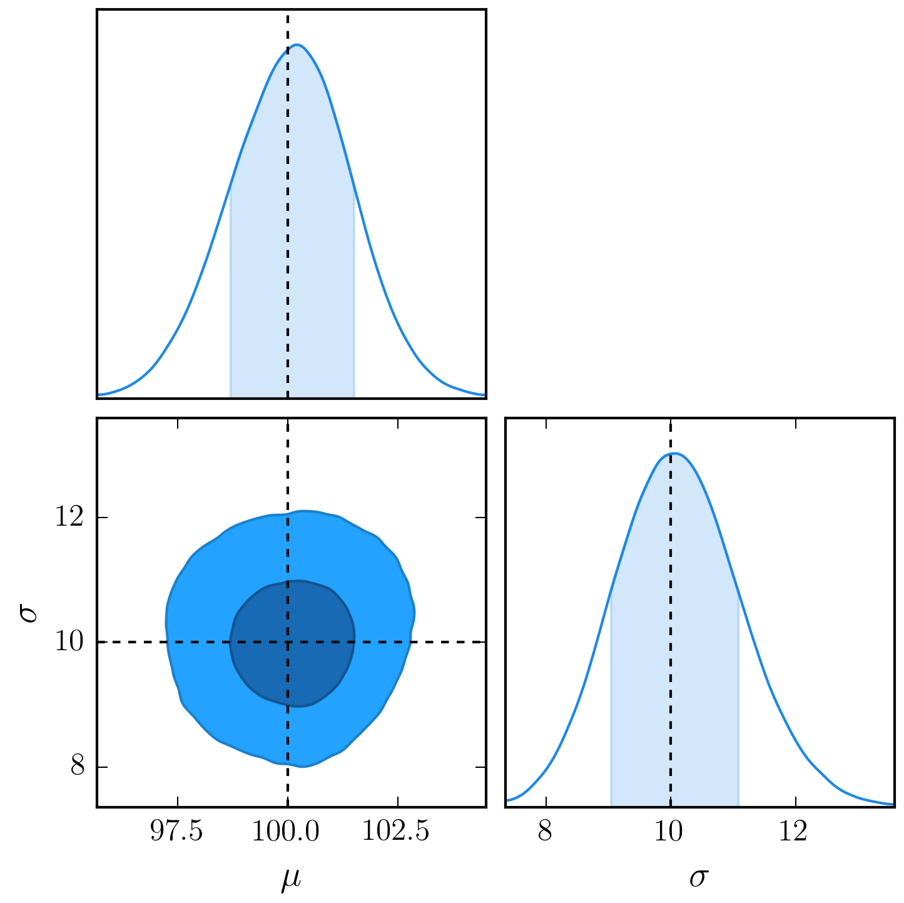
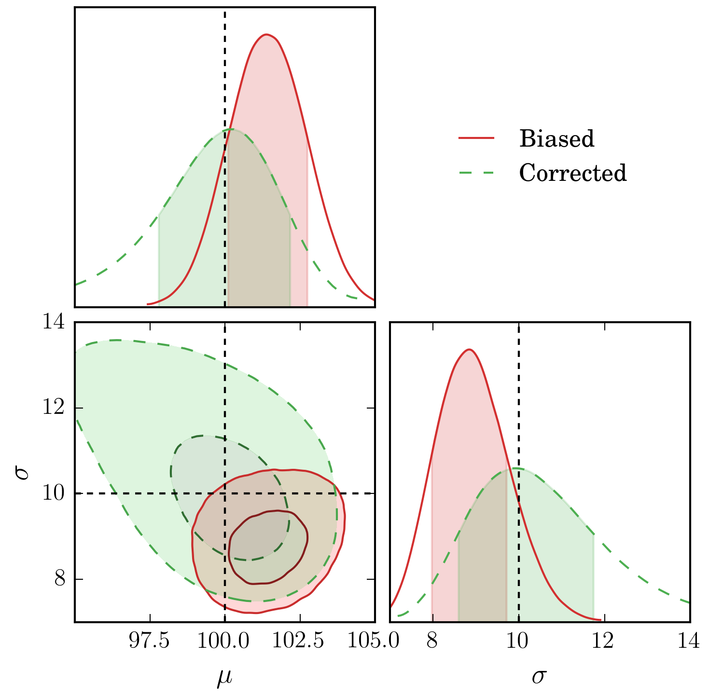
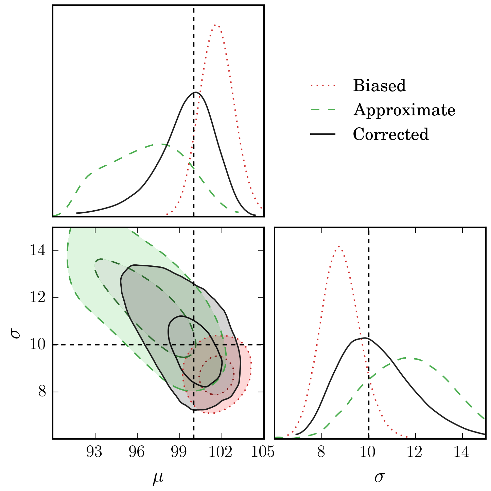

# SampleSelection

A useful overview of Sample Selection in a Bayesian Framework, and how to correct for it.

The code for all three examples used to generate the plots can be found in the `code` directory.

Executing the examples will save a rasterised image to `plots`, and a PDF image into the `paper` directory.

| `0_perfect.py` | `1_imperfect.py` | `2_real.py` |
| --- | --- | --- |
|  |  |  |

